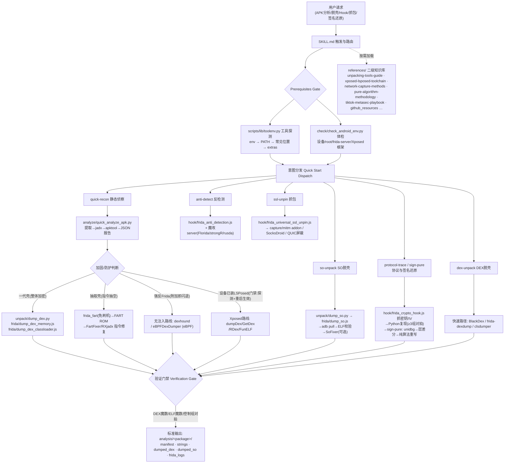

# dabo_android Skill

Android Native 逆向技能包：APK 分析、DEX/SO 脱壳、协议提取、反检测绕过。
本文档面向直接使用/二次开发本 skill 的用户。

## 🔭 整体工作流



## 📂 目录结构

```
dabo_android/
├── SKILL.md                          # Skill 主文件（工作流路由 + 决策树 + 验证门禁）
├── main.py                           # 可选交互式 CLI 启动器
├── scripts/
│   ├── lib/
│   │   ├── toolenv.py                # ★ 工具自动探测（零配置核心）
│   │   └── toolenv_extra.py          # 本机候选路径（可编辑/清空）
│   ├── check/check_android_env.py    # 环境体检（工具/设备/root/frida/Xposed）
│   ├── analyze/quick_analyze_apk.py  # 一键 APK 提取+反编译+报告
│   ├── unpack/
│   │   ├── dump_dex.py               # DEX 脱壳包装器
│   │   ├── dump_so.py                # SO dump 包装器（pull + ELF校验 + SoFixer）
│   │   └── frida/
│   │       ├── dump_dex_memory.js    # 内存搜 DEX（一代壳）
│   │       ├── dump_dex_classloader.js
│   │       ├── dump_so.js
│   │       └── list_modules.js       # 列出进程模块
│   ├── hook/
│   │   ├── frida_universal_ssl_unpin.js
│   │   ├── frida_anti_detection.js
│   │   └── frida_crypto_hook.js
│   ├── capture/
│   │   ├── mitm_full_capture.py      # mitmproxy 全量抓取 addon
│   │   └── mitm_run_full.py          # DumpMaster 驱动
│   └── generate/frida_script_generator.py
└── references/                       # 二级知识库（按需加载）
```

## 🚀 快速开始（零配置）

**工具不需要任何路径配置。** 所有脚本通过 `scripts/lib/toolenv.py` 自动定位外部工具：

```
可选环境变量(DABO_ADB/ANDROID_HOME/...) → PATH → 常见安装位置(含雷电/MuMu自带adb) → toolenv_extra.py
```

- 工具正常安装（含在 PATH）→ 直接可用
- 用雷电/MuMu 模拟器 → 自带 adb 自动被发现
- 特殊安装位置 → 编辑 `scripts/lib/toolenv_extra.py` 加一行即可
- 缺工具 → 脚本打印对应的安装指引，不会抛一堆 traceback

**外部依赖**（按需安装，`python scripts/check/check_android_env.py` 会逐项体检）：

| 工具 | 用途 | 安装 |
|------|------|------|
| adb | 设备交互 | [platform-tools](https://developer.android.com/tools/releases/platform-tools) 或模拟器自带 |
| frida-tools | 动态插桩 | `pip install frida-tools`（设备端还需 frida-server） |
| java (JDK 8+) | jadx/apktool 运行时 | [Adoptium](https://adoptium.net/) |
| jadx | DEX→Java 反编译 | [releases](https://github.com/skylot/jadx/releases)（默认安装位置自动识别） |
| apktool | 资源解包 | [apktool.org](https://apktool.org/) |
| frida-dexdump（可选） | 一键 DEX dump | `pip install frida-dexdump` |
| SoFixer（可选） | SO 修复 | 设置 `SOFIXER_PATH` 后 dump_so.py 自动调用 |

### 常用命令

```bash
# 环境体检 + 工具探测报告
python scripts/check/check_android_env.py
python scripts/lib/toolenv.py

# APK 快速分析（提取→jadx→apktool→报告）
python scripts/analyze/quick_analyze_apk.py com.example.app

# DEX 脱壳（一代壳内存搜索 / ClassLoader hook）
python scripts/unpack/dump_dex.py com.example.app --method memory

# SO dump（自动 pull + ELF 校验 + 可选 SoFixer）
python scripts/unpack/dump_so.py com.example.app --so libgame.so

# SSL Pinning 绕过 / 反检测 / 加密 Hook
frida -U -f com.example.app -l scripts/hook/frida_universal_ssl_unpin.js
frida -U -f com.example.app -l scripts/hook/frida_anti_detection.js
frida -U -f com.example.app -l scripts/hook/frida_crypto_hook.js

# 生成自定义 Hook 脚本
python scripts/generate/frida_script_generator.py --type hook-class --class com.example.Crypto

# 交互式菜单（可选）
python main.py
```

> 注：frida-tools ≥ 12（frida 16+）spawn 后自动 resume，命令无需 `--no-pause`；
> 旧版 frida 请自行追加该参数。

## ⚙️ 维护者备注

- `references/tool-paths.md` 保留了维护者机器的工具路径映射，仅作参考，
  脚本运行不依赖它（一切走 toolenv 探测）
- `toolenv_extra.py` 内是维护者本机的候选路径，对他机无效、可安全清空

## ⚠️ 免责声明

**本项目仅供合法用途。** 使用本技能包（含全部脚本与文档）即表示你已阅读、理解并同意以下条款：

1. **用途限定**：本项目仅面向授权安全测试、安全研究、教学演示、CTF 竞赛与个人学习等合法场景，用于帮助开发者和安全研究人员理解 Android 应用的保护机制与安全风险。

2. **授权前提**：对任何目标应用、系统进行逆向分析或动态调试前，你必须已获得相应所有者/运营者的明确授权。未经授权对他人软件进行逆向、破解、数据提取或干扰，在多数司法辖区可能构成违法。

3. **遵守法律**：使用者有责任了解并遵守所在司法辖区的全部适用法律与法规（包括但不限于著作权法、计算机软件保护条例、反不正当竞争法及网络安全相关法律）。

4. **责任自负**：本项目按"原样"（AS IS）提供，不作任何明示或默示的担保。作者与贡献者**不对任何人使用本项目的方式及由此产生的一切直接或间接后果承担任何责任**。任何人获取、修改、传播和使用本项目的行为，以及由此导致的法律责任、数据损失、业务中断或其他损失，均由行为人自行承担。

5. **不可控传播**：本项目开源发布后，任何人对其的复制、修改、二次分发及使用均不受作者控制，作者不为此类行为背书，亦不承担任何责任。若你不同意上述条款，请立即停止使用并删除本项目。

<details>
<summary>Disclaimer (English)</summary>

This project is provided for **lawful use only**: authorized security testing, security research, teaching, CTF, and personal learning. You must obtain explicit permission from the respective owners before analyzing or instrumenting any target application or system. The software is provided "AS IS", without warranty of any kind. The authors and contributors assume **no liability whatsoever** for how this project is used, modified, or redistributed by any third party, or for any direct or indirect damages arising from such use. Any misuse is the sole responsibility of the individual user. If you do not agree, stop using and delete this project.

</details>

---

**版本**: v2.2
**更新日期**: 2026-09-02
**变更**: v2.1→v2.2 脚本目录与文档对齐；新增 toolenv 零配置工具探测；
补齐 dump_so.py / list_modules.js；清理失效引用与 --no-pause；
新增脱壳升级阶梯（无注入/eBPF/免刷机FART）与 Xposed/LSPosed 路线（含门禁与重启生效规则）；README 增加整体工作流图
